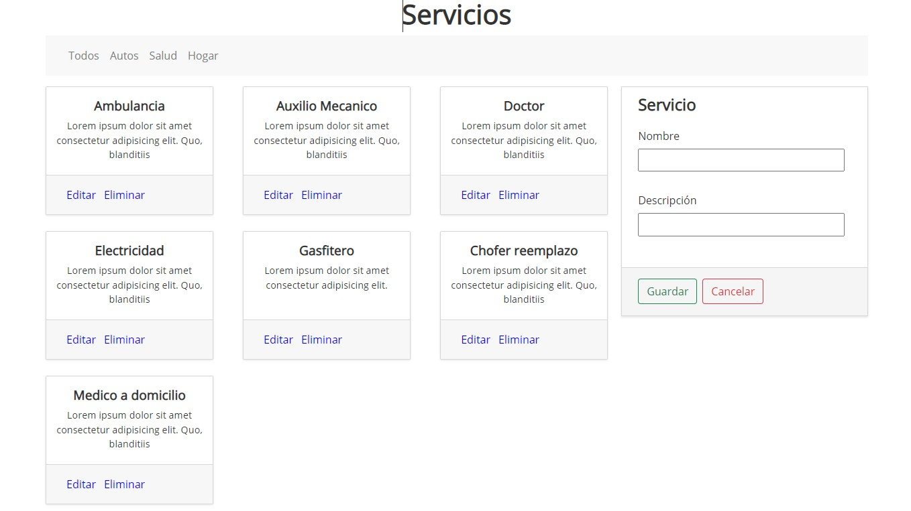

# Hi! 👋 I am Thouma

- [Mi Linkedin](https://www.linkedin.com/in/richard-allcca-llano/)

---

## Crud con Firestore

- Un CRUD con listado de servicios
- Tiene funciones basicas como, Crear, Leer, Actualizar y Eliminar
- Con una conexión a la base de datos Firestore
- UseContext para administrar la data con la respuesta de las peticiones a la DDBB
- También uso Bootstrap 5 para algunos detalles (aunque siendo sincero prefiero Css puro y duro 😉)

---

## Vista Previa

[Ver Demo en linea]()

---

## Dependencias

    npm i firebase
    npm i firestore

---

## Thema Vs code

- winter is comming (dark black)
